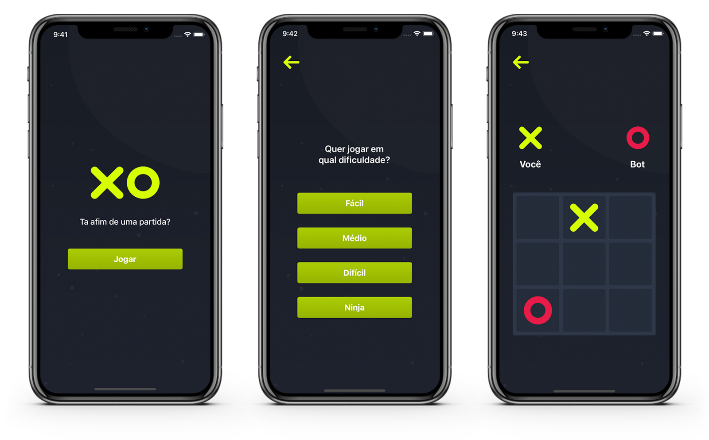

# tictactoe01

Tic tac toe challenge proposed by 01card to fill the React Native engineer position

## Quick dependency walkthrough

- [`expo`](https://github.com/expo/expo) because of their amazing SDK
- [`react-navigation`]() for navigation, obviously
- [`react-native-tailwindcss`](https://github.com/TVke/react-native-tailwindcss) for quick styling (and because I wanted to test it out 😝)
- [`jest`](https://github.com/facebook/jest) and [`testing-library`](https://github.com/testing-library/native-testing-library) for testing
- [`storybook`](https://github.com/storybookjs/storybook) for bullet proof component engineering and finally
- [`typescript`](https://github.com/microsoft/TypeScript) just because... 
